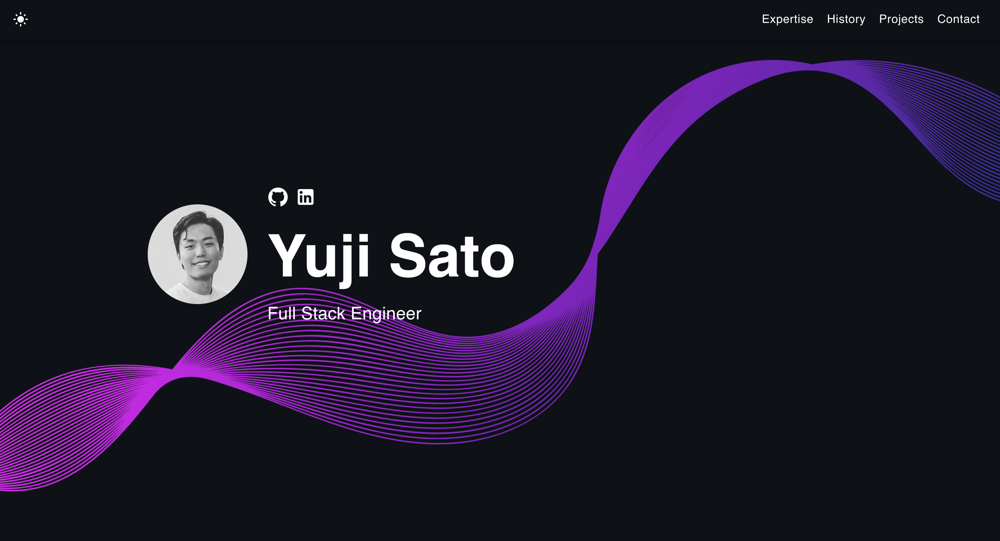

<<<<<<< HEAD
<<<<<<< HEAD
<<<<<<< HEAD
<<<<<<< HEAD
<<<<<<< HEAD
<<<<<<< HEAD
<<<<<<< HEAD
<<<<<<< HEAD
<<<<<<< HEAD
<<<<<<< HEAD
<<<<<<< HEAD
# my-portfolio
=======
# Getting Started with Create React App
=======
# yujisatojr.com
>>>>>>> a917167 (upgrade yarn dependencies)
=======
# My Portfolio Website
>>>>>>> fe5735f (Change title tag of the site)
=======
# My Portfolio Website
>>>>>>> ff05f14 (Add readme)
=======
# YUJISATOJR.COM
>>>>>>> 1291f2f (Update readme)
=======
# Yuji's Portfolio Website
>>>>>>> a62616a (Update readme and few contents)
=======
# Yuji's Personal Website
>>>>>>> d9e7100 (Update readme)
=======
# My Portfolio 🚀
>>>>>>> 88ac3dd (Update readme)
=======
# Portfolio Template 🚀
>>>>>>> 051c014 (Update readme)
=======
# Portfolio Site Template 🚀
>>>>>>> 5b3ed38 (Update readme)
=======
# Developer Portfolio Template 🚀
>>>>>>> 46383e2 (Update readme)

      

## What is this?

This simple portfolio template is designed to showcase your past projects, career history, skill sets, and more.

View the [Demo](https://yujisatojr.github.io/react-portfolio-template/).

**This template is free to use, and no attribution is required.** You can fork or download this repository to customize it for your own use. Please don't forget to leave a ⭐ if you like this portfolio!



## Features

✅ Open source (free to use, no attribution required)  
✅ Responsive design & mobile-friendly  
✅ Supports both dark and light modes  
✅ Highly customizable multi-component layout  
✅ Built with modern technologies (React, TypeScript, JavaScript, and SCSS)  

## Quick Setup

1. Ensure you have [Node.js](https://nodejs.org/) installed. Check your installation by running:

    ```bash
    node -v
    ```

2. In the project directory, install dependencies:

    ```bash
    npm install
    ```

3. Start the development server:

    ```bash
    npm start
    ```

4. Open [http://localhost:3000](http://localhost:3000) to view the app in the browser.

5. Customize the template by navigating to the `/src/components` directory. Modify texts, pictures, and other information as needed.

<<<<<<< HEAD
<<<<<<< HEAD
<<<<<<< HEAD
Builds the app for production to the `build` folder.\
<<<<<<< HEAD
<<<<<<< HEAD
It correctly bundles React in production mode and optimizes the build for the best performance.

The build is minified and the filenames include the hashes.\
Your app is ready to be deployed!

See the section about [deployment](https://facebook.github.io/create-react-app/docs/deployment) for more information.

### `yarn eject`

**Note: this is a one-way operation. Once you `eject`, you can’t go back!**

If you aren’t satisfied with the build tool and configuration choices, you can `eject` at any time. This command will remove the single build dependency from your project.

Instead, it will copy all the configuration files and the transitive dependencies (webpack, Babel, ESLint, etc) right into your project so you have full control over them. All of the commands except `eject` will still work, but they will point to the copied scripts so you can tweak them. At this point you’re on your own.

You don’t have to ever use `eject`. The curated feature set is suitable for small and middle deployments, and you shouldn’t feel obligated to use this feature. However we understand that this tool wouldn’t be useful if you couldn’t customize it when you are ready for it.

## Learn More

You can learn more in the [Create React App documentation](https://facebook.github.io/create-react-app/docs/getting-started).

To learn React, check out the [React documentation](https://reactjs.org/).

### Code Splitting

This section has moved here: [https://facebook.github.io/create-react-app/docs/code-splitting](https://facebook.github.io/create-react-app/docs/code-splitting)

### Analyzing the Bundle Size

This section has moved here: [https://facebook.github.io/create-react-app/docs/analyzing-the-bundle-size](https://facebook.github.io/create-react-app/docs/analyzing-the-bundle-size)

### Making a Progressive Web App

This section has moved here: [https://facebook.github.io/create-react-app/docs/making-a-progressive-web-app](https://facebook.github.io/create-react-app/docs/making-a-progressive-web-app)

### Advanced Configuration

This section has moved here: [https://facebook.github.io/create-react-app/docs/advanced-configuration](https://facebook.github.io/create-react-app/docs/advanced-configuration)

### Deployment

This section has moved here: [https://facebook.github.io/create-react-app/docs/deployment](https://facebook.github.io/create-react-app/docs/deployment)

### `yarn build` fails to minify

This section has moved here: [https://facebook.github.io/create-react-app/docs/troubleshooting#npm-run-build-fails-to-minify](https://facebook.github.io/create-react-app/docs/troubleshooting#npm-run-build-fails-to-minify)
<<<<<<< HEAD
<<<<<<< HEAD
>>>>>>> 0c80d02 (switch project to react)
=======
>>>>>>> fe5735f (Change title tag of the site)
=======
>>>>>>> ff05f14 (Add readme)
=======
It correctly bundles React in production mode and optimizes the build for the best performance.
>>>>>>> e609fe3 (Update readme)
=======
It correctly bundles React in production mode and optimizes the build for the best performance.

## Usage
<<<<<<< HEAD
Once you complete the installation process indicated above, open the project folder and navigate to `/src/components` directory. Inside of it, you will find all the pages and components used within the template. You can then modify texts, pictures, and other information to your own.
>>>>>>> 88ac3dd (Update readme)
=======
Once you complete the installation process indicated above, open the project folder and navigate to `/src/components` directory. Inside of it you will find all the pages and components used within the template. You can then modify texts, pictures, and other information to your own.
>>>>>>> 50acee8 (Fix readme)
=======
    The page will reload if you make edits. You will also see any lint errors in the console.
=======
The page will reload if you make edits. You will also see any lint errors in the console.
>>>>>>> 71d7aa5 (Update readme)
=======
The page will reload if you make edits, and you will see any lint errors in the console.
>>>>>>> bf02832 (Revamp overall design)

If you are interested in creating a mockup image like the ones from the personal projects section, I recommend [Genmoo](https://gemoo.com/tools/browser-mockup-generator/). This website lets you generate sleek looking browser mockups for free.

## Deployment

You can choose your preferred service (e.g., [Netlify](https://www.netlify.com/), [Render](https://render.com/), [Heroku](https://www.heroku.com/)) for deployment. One of the easiest ways to host this portfolio is using GitHub Pages. Follow the instructions below for a production deploy.

1. **Set Up GitHub Repository**

    Create a new repository on GitHub for your portfolio app.

2. **Configure `package.json`**

    Edit the following properties in your `package.json` file:

    ```json
    {
        "homepage": "https://yourusername.github.io/your-repo-name",
        "scripts": {
            "predeploy": "npm run build",
            "deploy": "gh-pages -d build",
            ...
        }
    }
    ```

    Replace `yourusername` with your GitHub username and `your-repo-name` with the name of your GitHub repository.

3. **Deploy to GitHub Pages**

    Run the following command to deploy your app:

    ```bash
    npm run deploy
    ```

4. **Access Your Deployed App**

<<<<<<< HEAD
    After successfully deploying your app, you can access it at `https://yourusername.github.io/your-repo-name`.
>>>>>>> 5b3ed38 (Update readme)
=======
    After successfully deploying, you can access your app at `https://yourusername.github.io/your-repo-name`.
>>>>>>> bf02832 (Revamp overall design)
